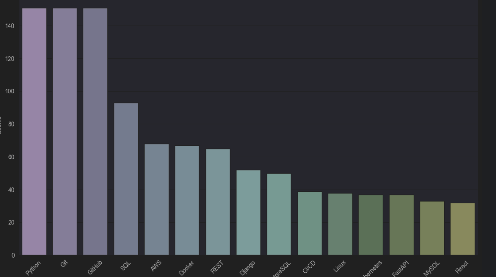

# Python Job Market Analysis

This project analyzes the job market for Python developers 
by scraping job listings from DOU.ua, extracting mentioned
technologies, and visualizing the results.

## Project Structure

- `parse.py`: Main script for scraping job listings and extracting technologies.
- `bar.ipynb`: Jupyter notebook for data analysis and visualization.
- `vacancies_technologies.csv`: Output file containing extracted technologies.

## Requirements

- Python 3.7+
- Chrome browser (for Selenium WebDriver)
- Required Python packages (see `requirements.txt`)

## Installation

1. Clone the repository:
   ```sh
   git clone https://github.com/yourusername/python-job-market-analysis.git
   cd python-job-market-analysis
   
2. Create and activate **venv** (bash):
   ```sh
   python -m venv venv
   source venv/Scripts/activate
   ```
   Windows (Command Prompt)
   ```sh
   python -m venv venv
   venv\Scripts\activate
   ```
   Mac / Linux (Unix like systems)
   ```sh
   python3 -m venv venv
   source venv/bin/activate
   ```
3. Install **requirements.txt** to your **venv**:
   ```sh
   pip install -r requirements.txt
   ```
4. Usage
   **Run the scraping script:**
   ```sh
   python parse.py
   ```
   *** This will create a vacancies_technologies.csv file with the extracted data. ***
   **Open and run the Jupyter notebook:** 
    ```sh
   jupyter notebook bar.ipynb
   ```

5. **Sample Output**

*Here's an example of the visualization you can expect:*
